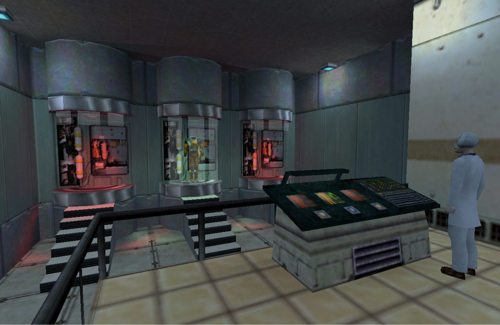

## What is the Source Engine?

The [*Source Engine*](https://en.wikipedia.org/wiki/Source_\(game_engine\)) is a game engine developed by the *[Valve Corporation](https://www.valvesoftware.com/en/)*, which was initially released in 2004 as the successor to [*GoldSrc*](https://en.wikipedia.org/wiki/GoldSrc). The engine is mainly known for its versatility, modding capabilities and its use in games like *Half-Life 2*, *Portal*, *Team Fortress 2* and *Counter-Strike: Source*.

The origins of the *Source Engine* go far back. It is a successor to *GoldSrc*, which is based on the [*Quake Engine*](https://en.wikipedia.org/wiki/Quake_engine) developed by [*id Software*](http://www.idsoftware.com/). *Valve* licensed it and heavily modified it for the creation of the original *Half Life.* After the success of *Half Life, Valve* decided to create a new engine with more modern capabilities named *Source Engine.* It is often perceived as an evolution of *GoldSrc*, but the *Source Engine* is largely a new engine.  

### Key milestones:

* When the engine first released in 2004, everyone was impressed by the advanced physics, high quality animations and realistic graphics for the time.   
* In 2006 they added HDR and Dynamic Shadows which greatly enhanced the realism.  
* The release of *Portal* and *Team Fortress 2* in 2007 demonstrated the engine’s versatility and capabilities, as both games had a different visual and gameplay style.  
* From 2010-2013 the *Source Engine* received numerous enhancements, like *MacOS* and *Linux* support, better rendering, better audio and better animations with *Portal 2*.  
* In 2015 the *Source 2 engine* was released, as a successor to the original *Source Engine*.

In the game development world, this engine has been revolutionary due to how iconic some features are. For example in *Counter Strike: Source*, b-hopping and crouch vaulting were bugs that became so iconic they turned into features which some other games have replicated outside of the *Source Engine*. The engine has truly set the standards in the gaming industry.

Something I find fun when playing *Source* games, is that *Portal 1*’s icon when running is just the *Half Life* icon, or when I play *Portal 2* that I can summon vehicles from *Half Life 2* and they work flawlessly. This is common across *Source* games.

## Legendary source games

- Half life 1, 2 and Alyx (λ)  
- Team Fortress Classic & 2  
- Counter strike 1.6  
- Garry’s mod (not Valve but legendary)   
- Portal Source & 2  
- Left 4 Dead 1 & 2  
- The Stanley Parable

## How did it become popular?

Back in 1996, Valve was founded by former Microsoft employees Gabe Logon Newell and Mike Harrington (both are legends). They have spent 13 years at Microsoft developing Windows, including the port of FPS game, [Doom](https://en.wikipedia.org/wiki/Doom_\(1993_video_game\)). Since the two presidents wanted to move onto a new venture using their shared wealth, they have decided to found Valve L.L.C.

About five miles from the Microsoft campus in [Redmond](https://en.wikipedia.org/wiki/Redmond,_Washington), on 24 August 1996 (Newell’s wedding day), Newel did not want a company name that suggested:

> testosterone-gorged muscles and the 'extreme' of anything

His alternatives names considered by the two presidents including Hollow Box, Fruitfly Ensemble and Rhino Scar

And that’s how Valve Corporation was found. Right at that point, Valve enlisted [Gearbox Software](https://en.wikipedia.org/wiki/Gearbox_Software) which included H-L: Opposing Force (Military based game), Blue Shift (Police based game) and Decay (Woman based game).

Also, Valve acquired TF Software, a group which made Team Fortress mod for Quake, and remade it for GoldSrc as Team Fortress Classic in 1999\. After that they released an SDK which was included with GoldSrc based games with numerous people creating their own published mods.

## The community involvement

The *Source Engine* has always been deeply tied to its **community**, sparking creativity and collaboration using great modding tools, user-generated content and active forums.

The *Source engine’s* flexibility and the availability of tools like the [*Source SDK*](https://en.wikipedia.org/wiki/Source_\(game_engine\)#Source_SDK) made it a favorite among modders. The community has significantly contributed to its legacy through mods, maps, and game expansions. Some of these mods even became their own standalone games\!

- **Garry’s Mod** was released in 2004, and it used to be a mod which is now a standalone game in which players can experiment with physics and more in a sandbox.  
- **Black Mesa** was released in 2020, and was a mod for *Half Life* which later turned into a commercial game by *Valve*.  
- **The Counter Strike series** started off as a mod for *Half Life*, which was later reimagined as *Counter Strike: Source*.  
- And so much more\!

*Valve* also created some tools for the community to mod with, like their official level editor called [*Hammer*](https://developer.valvesoftware.com/wiki/Valve_Hammer_Editor). This is a robust level creation tool which allowed players to make custom content for games, like *Team Fortress 2* and *Left 4 Dead 2*, and they thrived with custom maps and scenarios. This was also enhanced with the *Steam Workshop*, which made it easy for players to distribute their content for games.

This sparked a lot of talent in the community, leading to players learning game development and kickstarting their careers, which is very inspiring.
